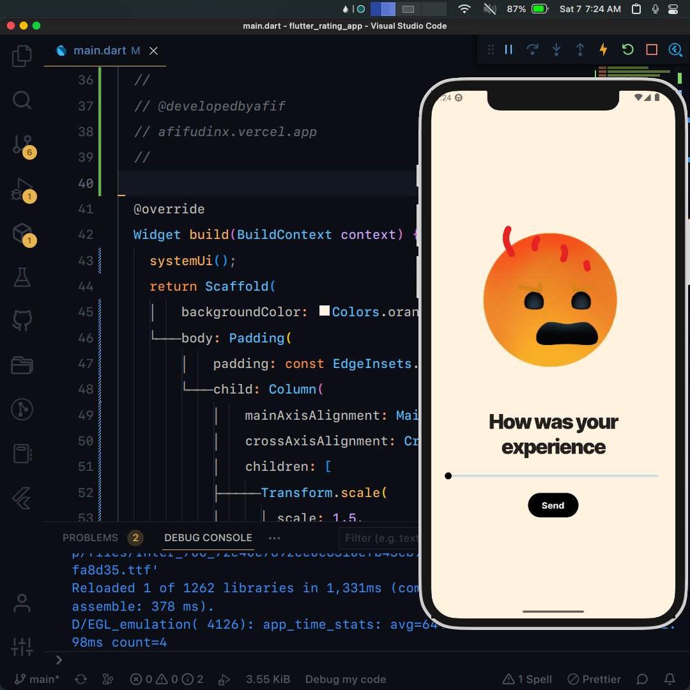

## Flutter UI - Rating App Example

```dart
void main() =>
    runApp(const MaterialApp(debugShowCheckedModeBanner: false, home: MyApp()));
```

## Development Setup
```
git clone https://github.com/afifcodes/flutter-rating-app-example.git
cd flutter-rating-app-example
flutter pub get
flutter run
```

## Screenshots


## Links

* [Website](https://afifcodes.vercel.app)
* [Youtube channel](https://youtube.com/afifcodes)
* [Instagram](https://instagram.com/afifcodes)
